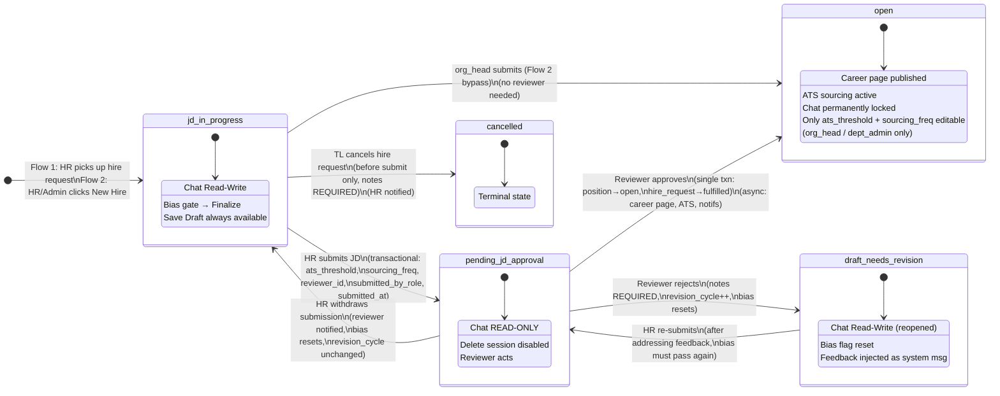
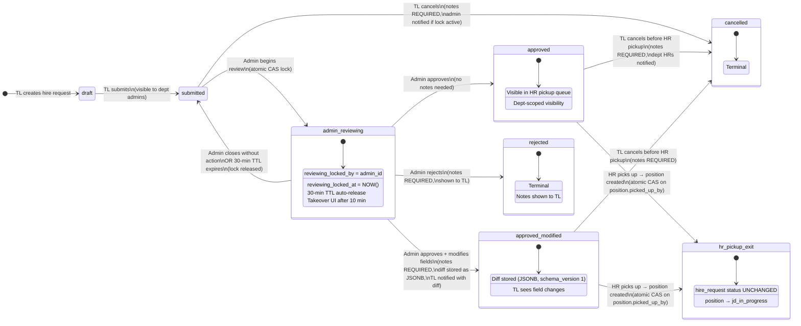
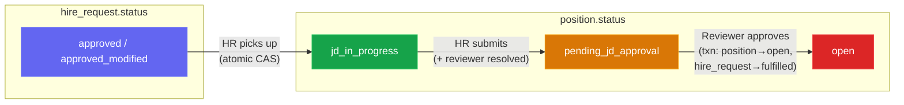

# State Machine Diagrams — AI Talent Lab

> Design Rev 4 · JD Generation & Position Approval Workflow
> Every box = a status. Every arrow = a transition with actor + data + side effects.

---

## 1. `position.status` State Machine

### Position Transition Rules Table

| # | From | → To | Triggered by | Data required | Notes required | Side effects |
|---|------|------|-------------|---------------|---------------|-------------|
| 1 | — (entry) | `jd_in_progress` | hr (Flow 1: pickup) | Atomic CAS on `picked_up_by` | — | hire_request stays approved |
| 2 | — (entry) | `jd_in_progress` | hr / dept_admin / org_head (Flow 2) | — | — | Position created directly |
| 3 | `jd_in_progress` | `pending_jd_approval` | hr / dept_admin | ats_threshold, sourcing_freq, reviewer_id, submitted_by_role, submitted_at | — | Reviewer notified |
| 4 | `jd_in_progress` | `open` | org_head (Flow 2 bypass) | — | — | Career page + ATS start |
| 5 | `jd_in_progress` | `cancelled` | team_lead | — | **YES** | HR notified |
| 6 | `pending_jd_approval` | `open` | resolved reviewer | — | — | Txn: position→open + hire_request→fulfilled; Async: career, ATS, notifs |
| 7 | `pending_jd_approval` | `draft_needs_revision` | resolved reviewer | — | **YES** | revision_cycle++, bias resets, feedback injected |
| 8 | `pending_jd_approval` | `jd_in_progress` | hr (withdraw) | — | — | Reviewer notified, bias resets |
| 9 | `draft_needs_revision` | `pending_jd_approval` | hr (re-submit) | — | — | Bias must pass again |

### Ambiguity Audit

| Check | Status |
|-------|--------|
| Can TL cancel after `pending_jd_approval`? | **NO** — must reject at review step |
| Can TL cancel after `open`? | **NO** — terminal in Phase 1 |
| Does `open` → `closed` exist? | **YES** but via separate status endpoint, not this state machine |
| Does `revision_cycle` increment on HR withdraw? | **NO** — only on reviewer rejection |
| Does bias reset on HR withdraw? | **YES** |

---

## 2. `hire_request.status` State Machine

### Hire Request Transition Rules Table

| # | From | → To | Triggered by | Data required | Notes required | Side effects |
|---|------|------|-------------|---------------|---------------|-------------|
| 1 | — (entry) | `draft` | team_lead | role_name, dept, headcount, etc. | — | Not visible to admins |
| 2 | `draft` | `submitted` | team_lead | — | — | Dept admins notified |
| 3 | `submitted` | `admin_reviewing` | dept_admin | Atomic CAS (zero rows = beaten) | — | Lock set |
| 4 | `submitted` | `cancelled` | team_lead | — | **YES** | Admin notified if lock active |
| 5 | `admin_reviewing` | `approved` | dept_admin | — | — | Visible in HR pickup queue |
| 6 | `admin_reviewing` | `approved_modified` | dept_admin | Modified fields | **YES** (diff stored) | TL notified with diff |
| 7 | `admin_reviewing` | `rejected` | dept_admin | — | **YES** | TL sees rejection notes |
| 8 | `admin_reviewing` | `submitted` | dept_admin (close) / system (TTL) | — | — | Lock released |
| 9 | `approved` | `cancelled` | team_lead (before HR pickup) | — | **YES** | Dept HRs notified |
| 10 | `approved_modified` | `cancelled` | team_lead (before HR pickup) | — | **YES** | — |
| 11 | `approved` / `approved_modified` | *(no status change)* | hr (picks up) | Atomic CAS on position | — | position → jd_in_progress |

### Ambiguity Audit

| Check | Status |
|-------|--------|
| Is `hr_pickup` a hire_request status? | **NO** — hire_request stays `approved`/`approved_modified`. Pickup tracked on position. |
| Can TL cancel after HR pickup? | **YES** but via position cancel (jd_in_progress → cancelled), not hire_request status change |
| Can two admins review simultaneously? | **NO** — atomic CAS lock prevents it |
| What happens on 30-min TTL? | Auto-release: status reverts to `submitted`, lock columns nulled |
| Can admin take over? | **YES** — after 10 min, other admins see "Take over" button. Same atomic CAS. |

---

## 3. Cross-Entity Link: Where the Two Machines Connect

---

## 4. Column Dependencies Per Transition

Each transition requires specific DB columns. This maps to the [migration checklist](schema_gap_analysis.md):

| Transition | Columns needed (⚠ = missing) |
|------------|------------------------------|
| HR pickup CAS | ⚠ `positions.picked_up_by`, ⚠ `positions.picked_up_at` |
| HR submits JD | ⚠ `positions.reviewer_id`, ⚠ `positions.submitted_by_role`, ⚠ `positions.submitted_at`, `positions.ats_threshold` ✓ |
| Reviewer rejects | ⚠ `positions.revision_cycle`, `positions.review_notes` ✓ |
| Authority snapshot | ⚠ `positions.submitted_by_role`, ⚠ `positions.reviewer_role_at_submit` |
| Admin review lock | ⚠ `hire_requests.reviewing_locked_by`, ⚠ `hire_requests.reviewing_locked_at` |
| Admin modify-approve | ⚠ `hire_requests.modification_diff` (JSONB) |
| Feedback injection | ⚠ `chat_messages.message_type`, ⚠ `chat_messages.revision_cycle`, ⚠ unique index |
